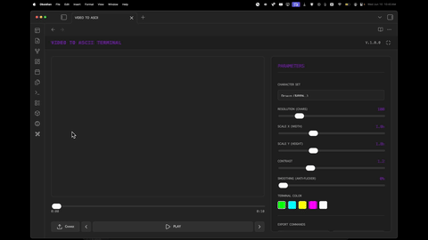
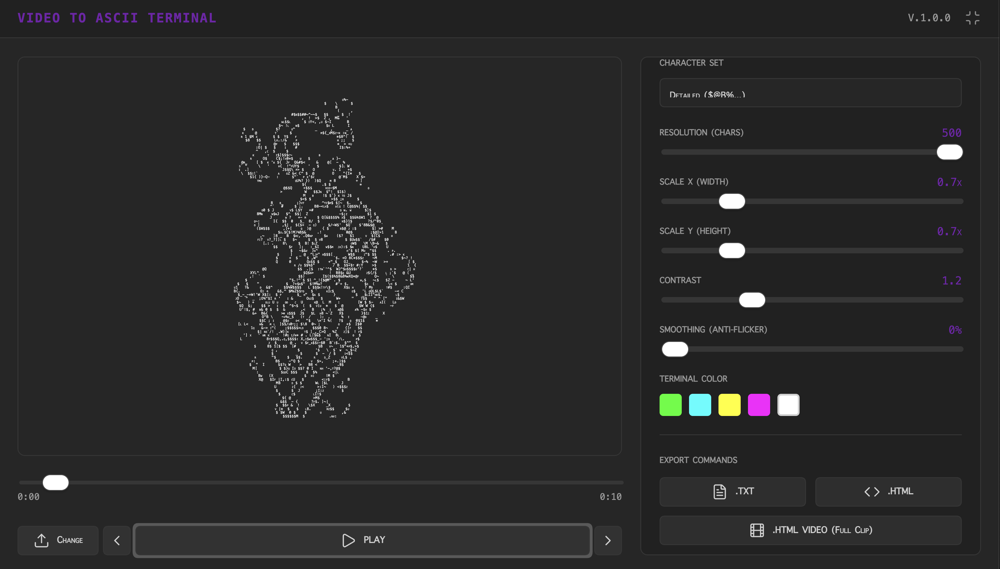

  
  
  <h1 align="center">VIDEO TO ASCII</h1>
  <h3 align="center"> Real-time Video-to-ASCII Art Converter </h3>

  <!-- TOP PURPLE LINKS -->
  
  
  
   
  <!-- BOTTOM GOLD TAXONOMY -->
  
  
  
  

  

    <i> A real-time video to ASCII art converter mapping frame luminance to customizable terminal glyphs. </i>
  

  

Welcome to **Video to ASCII**. This component processes local video files frame-by-frame, maps frame luminance levels to ASCII tokens, and presents them on an interactive viewport optimized for terminal visualizers.

---

## Features

### Data Ingestion & Analysis
*   **Real-Time Processing**: Render local video files frame-by-frame instantly.
*   **Custom Parameters**: Fine-tune contrast, resolution width, and X/Y aspect scaling.
*   **Phosphor Presets**: Custom retro theme colors for the terminal canvas.
*   **Flexible Exports**: Save frames as `.TXT` text files, single-frame `.HTML` scripts, or full interactive HTML video animations.

---

## Directory Index & Components

The package exposes the following files:

| File | Description |
| :--- | :--- |
| **[VIDEO TO ASCII.md](VIDEO%20TO%20ASCII.md)** | Primary Datacore view launcher. |
| **[src/index.jsx](src/index.jsx)** | Safe Agent, fulltab reparenting bootstrapper. |
| **[src/components/VideoToAscii.jsx](src/components/VideoToAscii.jsx)** | Main processing and player component. |
| **[src/styles/styles.jsx](src/styles/styles.jsx)** | Custom Obsidian theme CSS styles. |
| **[src/utils/asciiProcessor.js](src/utils/asciiProcessor.js)** | ASCII processing utility functions. |
| **[METADATA.md](METADATA.md)** | Packaging manifest outlining complexity, category, and dependencies. |
| **[CONTRIBUTION.md](CONTRIBUTION.md)** | Guidelines on zero ESM exports and modular layout. |
| **[LICENSE.md](LICENSE.md)** | License specifications. |

---

## Quick Start

1. Download the Repository (cloning or downloading into the Obsidian vault folder).
2. Install Datacore (ensuring the plugin is active).
3. Open the Entry Note (specifying the exact loader note `VIDEO TO ASCII.md`).

---

## Previews

| Preview | Description |
| :--- | :--- |
|  | Video to ASCII converter UI with terminal color controls and character resolution configuration. |

---

## Contributors

- beto.group
